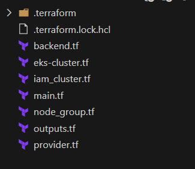
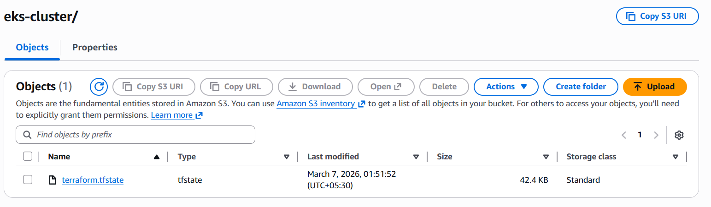
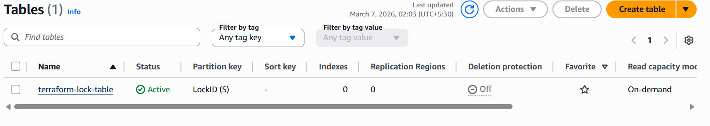
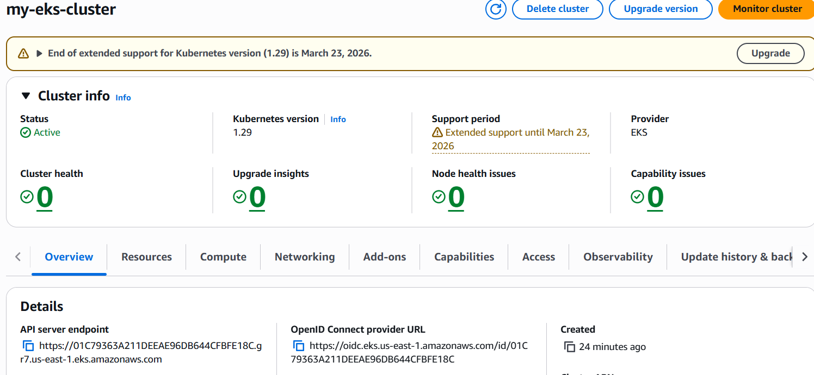
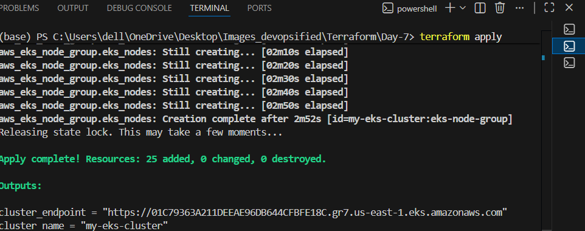

# 🚀 Terraform AWS EKS Deployment

This project demonstrates how to deploy an **Amazon EKS (Elastic Kubernetes Service) cluster using Terraform** while implementing **remote state management using Amazon S3 and DynamoDB**.

---

# 📂 Terraform Project Structure

<p align="center">
  
</p>

This Terraform project is structured using multiple `.tf` files to organize infrastructure code clearly.

---

# ☁️ Terraform Remote Backend (S3)

<p align="center">
  
</p>

Terraform state is stored in **Amazon S3** which allows:

* Centralized state management
* Team collaboration
* Secure infrastructure tracking
* Versioning and backup

---

# 🔒 Terraform State Locking with DynamoDB

<p align="center">
  
</p>

A **DynamoDB table** is used for **state locking**, ensuring that only one Terraform operation runs at a time and preventing state corruption.

---

# ☸️ Amazon EKS Cluster

<p align="center">
  
</p>

Terraform provisions an **Amazon EKS cluster with worker node groups**, allowing Kubernetes workloads to run on AWS infrastructure.

---

# 📊 Terraform Apply Output

<p align="center">
  
</p>

The output confirms that the infrastructure resources were successfully created using Terraform.

---

# ⚙️ Tools & Technologies

* Terraform
* AWS EKS
* Amazon S3
* Amazon DynamoDB
* IAM
* Git & GitHub

---

# ▶️ Terraform Workflow

Initialize Terraform:

```bash
terraform init
```

Check infrastructure plan:

```bash
terraform plan
```

Apply the infrastructure:

```bash
terraform apply
```

---
Cloud | DevOps | Terraform | AWS | Kubernetes
